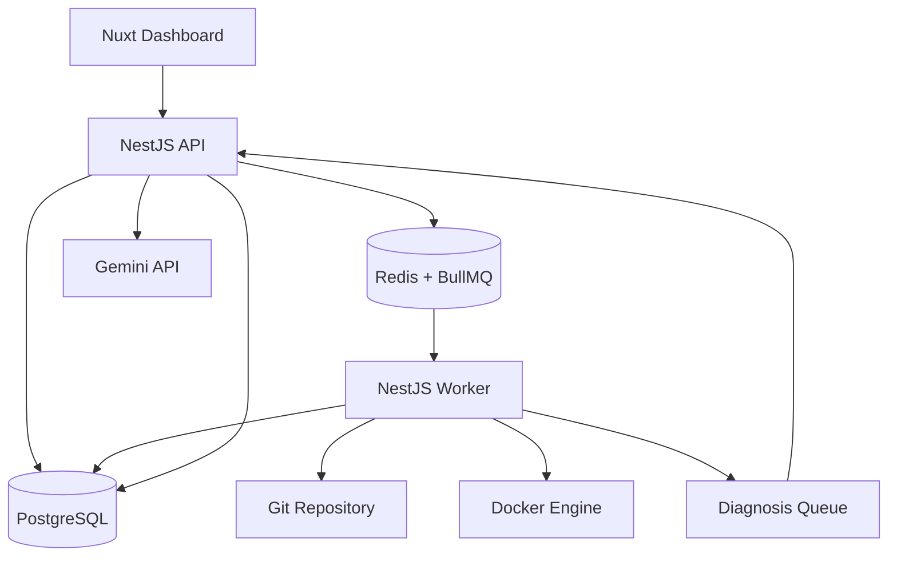
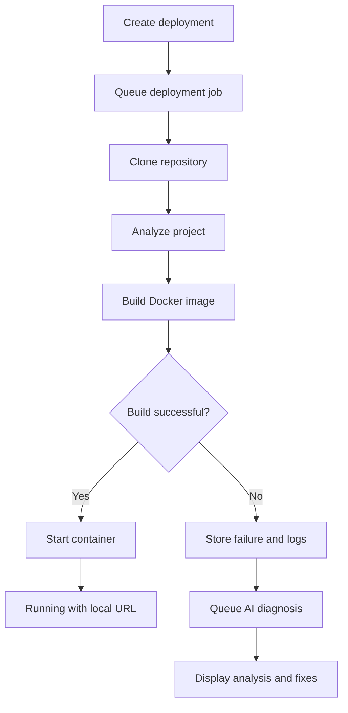

<div align="center">

# 🚀 DevPilot

### Self-Hosted Deployment Automation with AI-Assisted Failure Diagnosis

A local deployment platform that automates repository analysis, Docker deployments, background processing, deployment tracking, and AI-powered failure diagnosis.


</div>

---

## 📖 About DevPilot

DevPilot is a portfolio and learning project inspired by platforms such as Vercel.

It takes a Git repository through an automated deployment workflow that includes source-code analysis, queued background processing, Docker image creation, container startup, deployment tracking, and log collection.

When a deployment fails, DevPilot uses Gemini to analyze the stored failure context and provide:

- A concise failure summary
- The likely root cause
- Relevant log evidence
- Recommended fixes
- A confidence score

The diagnosis can be generated automatically after a failed deployment or regenerated manually from the dashboard.

> [!IMPORTANT]
> DevPilot was built as a local engineering project to explore deployment automation, background job processing, containerization, and practical AI integration. It is not currently intended to be a production hosting service.

---

## 🎯 Why I Built It

Most of my earlier projects focused on conventional web application features. I wanted to work on a system that involved more than CRUD operations and learn how multiple services coordinate during a long-running and failure-prone process.

DevPilot gave me practical experience with:

- Asynchronous processing with Redis and BullMQ
- Docker-based build and runtime workflows
- Deployment state transitions and persistent logs
- Coordination between a dashboard, API, worker, database, and queue
- Failure handling across service boundaries
- AI-generated troubleshooting based on real deployment evidence

---

## ✅ Current Milestone

The current portfolio milestone supports the following local workflow:

1. Create and configure a project using a Git repository.
2. Queue a deployment through the API.
3. Clone the selected branch and capture commit metadata.
4. Analyze the repository, framework, package manager, and commands.
5. Build a Docker image for supported project structures.
6. Start the application inside a Docker container.
7. Track deployment status, logs, history, port, and local live URL.
8. Stop or restart supported deployments.
9. Record failures without losing the original error context.
10. Automatically generate and persist a Gemini-powered failure diagnosis.
11. Load, poll, display, and manually regenerate the diagnosis from the dashboard.

---

## ✨ Key Features

### Project and deployment management

- Authentication and protected user sessions
- Project and repository management
- Git repository cloning and branch processing
- Commit SHA and commit-message capture
- Deployment history and detailed status tracking

### Deployment automation

- Redis and BullMQ deployment queue
- Independent background deployment worker
- Framework and package-manager analysis
- Docker image building
- Docker container execution
- Local live URL and assigned-port tracking
- Stop and restart controls

### Logs and failure handling

- Persistent structured deployment logs
- Deployment lifecycle state management
- Build and runtime failure handling
- Preservation of the original failure evidence
- Clear handling of unsupported projects

### AI-powered diagnosis

- Manual AI failure analysis
- Automatic diagnosis after deployment failure
- Persisted diagnosis results
- Dashboard polling while analysis is processing
- Failure summary and likely root cause
- Relevant log evidence
- Recommended fixes
- Confidence score
- Manual diagnosis regeneration

---

## 🏗️ System Architecture



The API manages authentication, projects, deployments, persisted diagnoses, and queue creation.

The worker performs long-running deployment operations separately so the API can remain responsive. PostgreSQL stores application state and logs, while Redis and BullMQ coordinate background jobs.

Docker provides isolated build and runtime environments.

AI diagnosis is isolated from the actual deployment process. A Gemini provider failure cannot change, replace, or hide the original deployment failure.

---

## 🔄 Deployment Workflow



---

## 🤖 AI Failure Diagnosis

AI is used as a focused troubleshooting layer rather than as the deployment engine itself.

After a deployment enters the `FAILED` state, DevPilot:

1. Preserves the original error message and relevant logs.
2. Adds an independent diagnosis job to a queue.
3. Sends sanitized failure context to Gemini.
4. Validates the structured AI response.
5. Saves the completed diagnosis in PostgreSQL.
6. Lets the dashboard poll until the diagnosis becomes available.
7. Keeps a manual regenerate option for retries.

Each diagnosis contains:

| Diagnosis field | Purpose |
| --- | --- |
| Failure summary | Provides a short explanation of what failed |
| Likely root cause | Identifies the probable technical reason |
| Relevant log lines | Shows the evidence used during diagnosis |
| Recommended fixes | Suggests practical steps for resolving the failure |
| Confidence score | Shows the confidence level of the analysis |
| Provider metadata | Records the AI provider and model used |

This design ensures the AI feature assists the developer without controlling the deployment lifecycle.

---

## 🛠️ Technology Stack

| Area | Technologies |
| --- | --- |
| Dashboard | Nuxt 4, Vue 3, TypeScript, Tailwind CSS |
| Backend API | NestJS, TypeScript |
| Background processing | NestJS Worker, BullMQ, Redis |
| Database | PostgreSQL, Prisma ORM |
| Deployment engine | Git, Docker |
| AI diagnosis | Google Gemini API |
| Monorepo tooling | pnpm workspaces |

---

## 📁 Repository Structure

```text
DevPilot/
├── apps/
│   ├── api/          # Authentication, projects, deployments and diagnosis API
│   ├── dashboard/    # Nuxt user interface
│   └── worker/       # Background deployment processor
│
├── packages/
│   ├── database/     # Prisma schema and shared database client
│   └── shared-types/ # Shared queue contracts and application types
│
└── docker-compose.yml
```

---

## 🚀 Local Setup

### Prerequisites

Make sure the following tools are installed:

- Node.js 20 or another compatible LTS version
- pnpm
- Git
- Docker Desktop or Docker Engine
- A Gemini API key for AI diagnosis

### 1. Clone the repository

```bash
git clone <your-repository-url>
cd DevPilot
pnpm install
```

### 2. Start the infrastructure

```bash
docker compose up -d
```

The local development configuration uses PostgreSQL and Redis containers.

Check the values in `docker-compose.yml` and your environment files before starting the applications.

### 3. Configure environment variables

Copy the provided example environment files and add your local values.

The exact files may vary between applications, but the main configuration includes:

```env
DATABASE_URL=postgresql://<user>:<password>@localhost:<port>/<database>

REDIS_HOST=localhost
REDIS_PORT=6380

GEMINI_API_KEY=<your-key>
GEMINI_DIAGNOSIS_MODEL=gemini-3.5-flash-lite
```

Add any authentication, cookie, API URL, Docker, or port variables listed in the repository’s `.env.example` files.

> [!WARNING]
> Never commit real API keys, passwords, tokens, or other secrets to the repository.

### 4. Prepare the database and shared packages

```bash
pnpm --filter @devpilot/database build
pnpm --filter @devpilot/shared-types build
```

Run the Prisma migration or generation commands defined by the database package when setting up a fresh database.

### 5. Start the applications

Run the API, worker, and dashboard in separate terminals:

```bash
pnpm --filter @devpilot/api dev
```

```bash
pnpm --filter @devpilot/worker dev
```

```bash
pnpm --filter @devpilot/dashboard dev
```

Typical local addresses:

| Application | Local address |
| --- | --- |
| Dashboard | `http://localhost:3000` |
| API | `http://localhost:4000/api` |

Confirm the actual values using your environment configuration.

---

## 📸 Screenshots

Add the final screenshots under:

```text
docs/screenshots/
```

Recommended screenshots:

### Project dashboard


### Deployment details and logs


### Successful local deployment


### AI failure diagnosis


> [!NOTE]
> Add screenshots using these exact filenames or update the paths above before publishing the repository.

---

## ⚠️ Current Scope and Limitations

- DevPilot currently targets local development and portfolio demonstration.
- Deployment support is intentionally limited to tested project structures and package-manager combinations.
- Unsupported frameworks or missing Dockerfile-generation strategies fail with an explicit explanation.
- Live applications use local ports rather than public subdomains or custom domains.
- Project-level environment-variable management is not included in this milestone.
- GitHub OAuth, repository selection, webhooks, and automatic deployment on push are not implemented.
- Production secret storage, HTTPS, resource isolation, backups, monitoring, and multi-server execution are outside the current scope.
- AI diagnosis depends on the configured provider and should be treated as guidance rather than a guaranteed solution.

These limitations are documented deliberately so the project remains honest, focused, and reproducible as a local portfolio system.

---

## 🗺️ Future Roadmap

Possible future improvements include:

- Wider framework and package-manager support
- Project-level environment variables with secure secret handling
- GitHub OAuth and repository selection
- Automatic deployments using GitHub webhooks
- Real-time logs using Server-Sent Events or WebSockets
- Retry, redeploy, cancellation, and rollback workflows
- Reverse proxy and unique deployment subdomains
- HTTPS and custom-domain support
- Container resource limits and automated cleanup
- Broader automated test coverage
- Production deployment to a VPS or cloud environment

---

## 💡 What This Project Demonstrates

DevPilot demonstrates my ability to work beyond a standard CRUD application and reason about asynchronous, multi-service workflows.

The most valuable engineering areas for me were:

- Defining and managing deployment state transitions
- Keeping background jobs isolated from HTTP requests
- Preserving useful failure evidence
- Coordinating Redis queues with persistent database state
- Controlling Docker build and runtime processes
- Handling failures across multiple services
- Adding AI without making it responsible for the system’s core behavior
- Connecting a modern frontend with deployment and diagnosis workflows

---

## 📌 Project Status

> **Portfolio milestone complete — active feature development paused.**

The core local deployment workflow and AI-assisted failure-analysis workflow are complete.

The remaining items are documented as future improvements rather than being presented as completed production capabilities.

---

## 👨‍💻 Author

**Janindu Chamod**

- LinkedIn: [linkedin.com/in/janinduchamod](https://www.linkedin.com/in/janinduchamod/)
- GitHub: [github.com/Janinduchamod2001425](https://github.com/Janinduchamod2001425/)

---

<div align="center">

Built as a portfolio and learning project to explore deployment automation, distributed workflows, Docker, and practical AI integration.

</div>